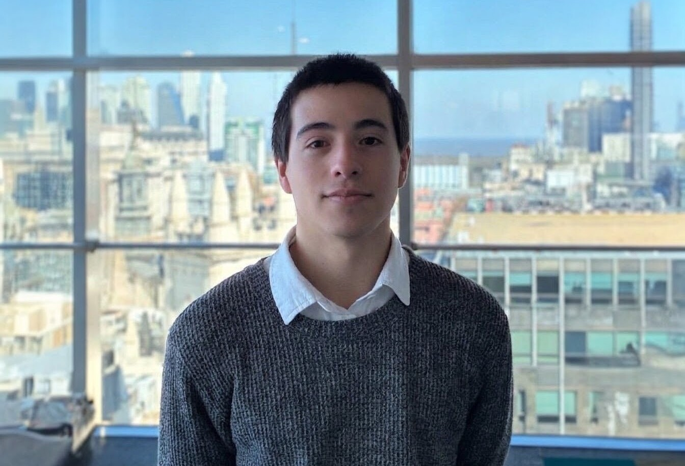

Soy Tobías Gabriel Fioroni, un apasionado de la infraestructura tecnológica, las redes de datos y la ciberseguridad defensiva. Mi interés por el ámbito informático surge de la necesidad constante de comprender el funcionamiento interno de los sistemas: desde el flujo de datos a bajo nivel en un protocolo de red, hasta las estrategias de protección en entornos corporativos.

Actualmente desarrollo mi carrera académica a través de dos frentes complementarios: curso la Tecnicatura Universitaria en Redes Informáticas en la Universidad Nacional del Oeste (UNO) y la Licenciatura en Ciberdefensa en la Universidad de la Defensa Nacional (UNDEF). Mi formación combina la administración de infraestructura (Active Directory, Windows, Linux) con el análisis de redes y la ciberseguridad; complementando estas habilidades con automatización en Python y PowerShell.

Entiendo que la solvencia técnica alcanza su verdadero valor cuando se complementa con sólidas habilidades interpersonales. Mi experiencia previa en atención al cliente y gestión operativa me permitió desarrollar herramientas fundamentales para el trabajo en equipo: comunicación efectiva, empatía con el usuario final, capacidad de diagnóstico estructurado y resolución de problemas bajo presión. Estas bases son las que hoy aplico a las mejores prácticas de gestión de servicios (ITSM e ITIL).

Con el objetivo de mantener un aprendizaje continuo y alineado a los estándares de la industria, formo parte de una capacitación técnica especializada en Soporte IT (impulsada por Novatium y Pampa Energía) y me encuentro preparando certificaciones clave del sector, como la SC-900 de Microsoft y el CCNA de Cisco.

Este blog es mi plataforma para documentar mi proceso de aprendizaje, publicar análisis técnicos y compartir guías de mis prácticas en laboratorios. Mi meta profesional es integrarme a equipos de Infraestructura, Redes o Ciberseguridad, aportando rigor técnico, proactividad y una búsqueda constante de mejora operativa.

---

### Skills

- **Soporte & ITSM (ITIL 4):** Ciclo de vida del ticket, gestión de Incidentes (Impacto x Urgencia) y Solicitudes de Servicio. Métricas SLA, FCR y MTTR. Herramienta InvGate Service Management. Nociones de IMAC e ITAM.
- **Redes:** Modelo OSI, TCP/IP, direccionamiento IPv4/IPv6, Subnetting (VLSM/CIDR), DNS, DHCP y Ethernet 802.3. Troubleshooting de conectividad vía CLI (ping, traceroute, netstat, tablas de ruteo) y análisis de tráfico con Wireshark/Tshark.
- **Infraestructura & Sistemas:** Windows Server y Active Directory Domain Services (OUs, grupos de seguridad, GPOs). Administración de Windows Client y Linux (Debian/Ubuntu). Virtualización en VMware Workstation y VirtualBox.
- **Seguridad e Identidades:** Fundamentos de seguridad en la nube de Microsoft, gestión de accesos (IAM), MFA y buenas prácticas de seguridad para usuarios finales.
- **Scripting:** Sintaxis básica de PowerShell y fundamentos de Python aplicados a la automatización de tareas.
- **Idiomas:** Español (Nativo) | Inglés (Intermedio - Lectura fluida de documentación técnica y análisis de logs).

### Hands-on
- **Resolución de CTFs & DFIR:** Prácticas continuas de seguridad ofensiva y defensiva en plataformas como HackTheBox, TryHackMe y CyberDefenders (+50).
- **Home Labs:** Despliegue de controladores de dominio (Active Directory, Windows Server 2019) para pruebas de políticas y seguridad, y simulación de topologías de red en Cisco Packet Tracer.

### Certifications (En preparación)

- Cisco Certified Network Associate **(CCNA 200-301)** 
- Microsoft Security, Compliance, and Identity Fundamentals **(SC-900)**